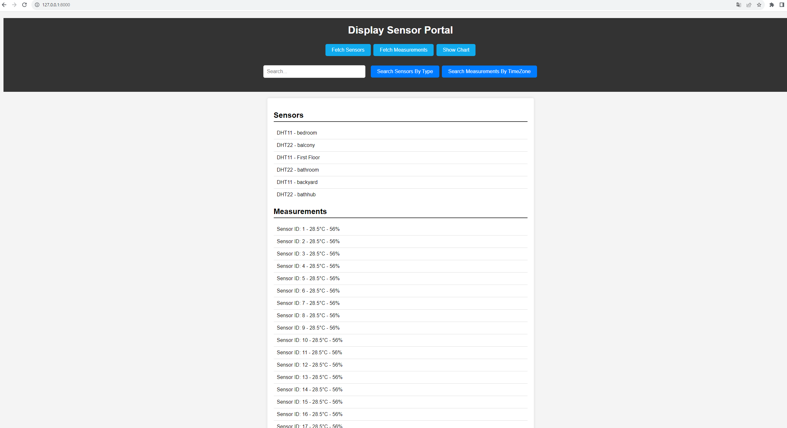
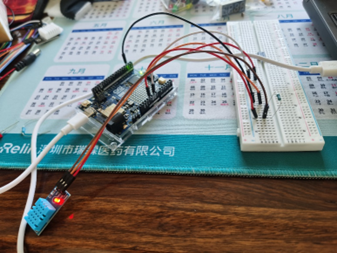
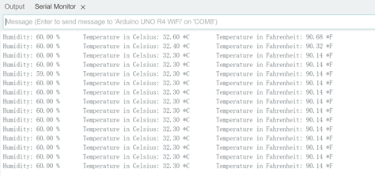
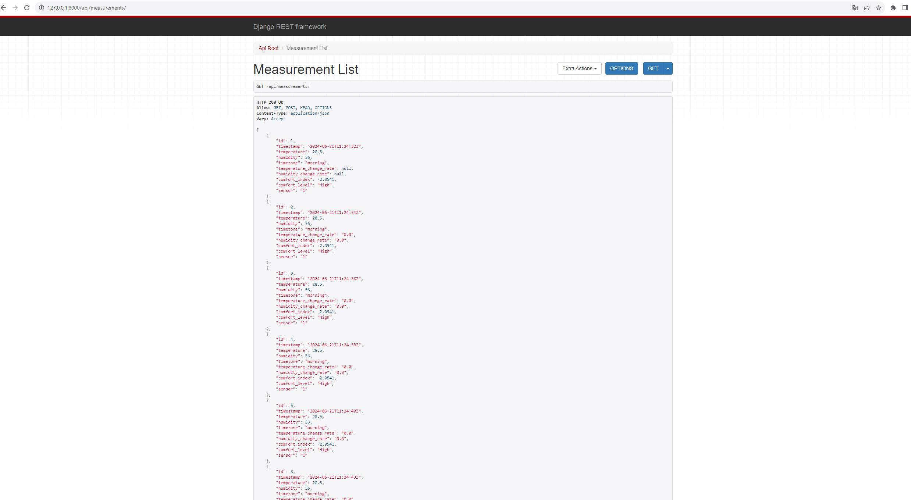
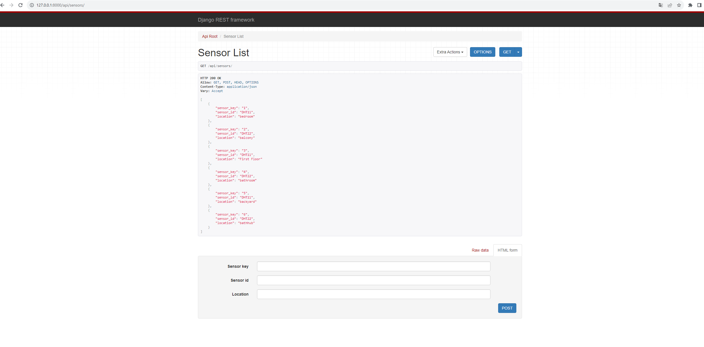

### Project Background

This project focuses on developing a sensor-based system utilizing various sensors, including DHT11, DHT22, and MAX30102. The project involved comprehensive circuit design for the sensors, incorporating operations like operational amplifier filtering. An Arduino was employed to receive the sensor data, which was subsequently organized into Excel spreadsheets. This data was then imported into a MySQL database. The backend was developed using Python's Django framework, while the frontend was built with React. The system provides full CRUD (Create, Read, Update, Delete) functionality for the sensors and their data, presented through a well-structured and visually appealing frontend interface.

### Technical Skills Demonstrated

1. **Sensor Integration and Circuit Design**
   - Utilized DHT11, DHT22, and MAX30102 sensors for data collection.
   - Designed circuits for sensors, including operational amplifier filtering.

2. **Microcontroller Programming**
   - Programmed Arduino for data acquisition from sensors.
   - Managed data transmission from sensors to storage.

3. **Data Management and Storage**
   - Organized sensor data into Excel spreadsheets.
   - Imported data into a MySQL database.
   - Created and managed the database schema for efficient data handling.

4. **Backend Development**
   - Developed the backend using Python's Django framework.
   - Implemented CRUD operations for sensor data management.

5. **Frontend Development**
   - Built the frontend using React.
   - Designed a user-friendly and visually appealing interface.
   - Ensured efficient data visualization and interaction.

6. **Full-Stack Development**
   - Integrated the frontend and backend to provide seamless functionality.
   - Ensured data consistency and integrity across the system.

7. **Database Management**
   - Created and managed MySQL databases.
   - Optimized database queries for performance.

8. **Data Visualization**
   - Developed visual representations of sensor data for easy interpretation.
   - Ensured the frontend interface was intuitive and user-friendly.

This project highlights my ability to integrate hardware and software components, demonstrating proficiency in circuit design, microcontroller programming, data management, backend development with Django, frontend development with React, and full-stack integration for a comprehensive sensor data management system.

Here are some images during this project:

Circuit Build Design DHT11

Arduino Measurement

Python Django Backend API measurements 

Python Django Backend API snesors

Circuit Build Design Amplifier

Show MySQL Table Results

### 项目背景

本项目旨在开发一个基于传感器的系统，使用包括DHT11、DHT22和MAX30102在内的各种传感器。项目涉及到传感器的全面电路设计，包括运算放大器滤波操作。使用Arduino接收传感器数据，然后将数据整理到Excel电子表格中，随后将这些数据导入到MySQL数据库中。后端开发使用了Python的Django框架，前端则使用了React构建。系统提供了传感器及其数据的完整CRUD（创建、读取、更新、删除）功能，通过结构良好且视觉上吸引人的前端界面展示。

### 展示的技术技能

1. **传感器集成和电路设计**
   - 使用DHT11、DHT22和MAX30102传感器进行数据收集。
   - 设计传感器电路，包括运算放大器滤波。

2. **微控制器编程**
   - 编程Arduino以获取传感器数据。
   - 管理从传感器到存储的数据信息传输。

3. **数据管理和存储**
   - 将传感器数据整理到Excel电子表格中。
   - 将数据导入到MySQL数据库中。
   - 创建并管理数据库模式以实现高效的数据处理。

4. **后端开发**
   - 使用Python的Django框架开发后端。
   - 实现传感器数据管理的CRUD操作。

5. **前端开发**
   - 使用React构建前端。
   - 设计用户友好且视觉上吸引人的界面。
   - 确保高效的数据可视化和交互。

6. **全栈开发**
   - 集成前端和后端以提供无缝功能。
   - 确保系统数据的一致性和完整性。

7. **数据库管理**
   - 创建并管理MySQL数据库。
   - 优化数据库查询以提高性能。

8. **数据可视化**
   - 开发传感器数据的可视化表示，便于理解。
   - 确保前端界面直观且用户友好。

该项目展示了我在硬件和软件组件集成方面的能力，展示了我在电路设计、微控制器编程、数据管理、使用Django进行后端开发、使用React进行前端开发以及综合传感器数据管理系统的全栈集成方面的熟练程度。

